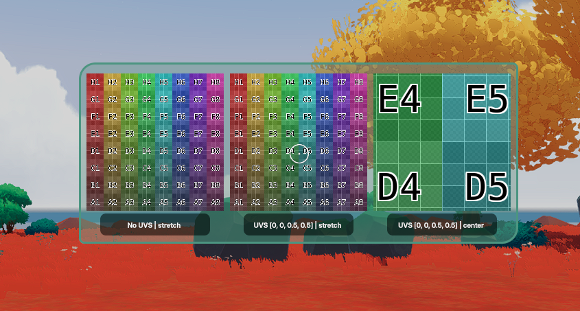

# Bug: UVs on UiEntity Have No Effect

## The Issue

In Decentraland SDK 7, the `uvs` property on a `UiEntity`'s `uiBackground` does not appear to have any effect. The specified UV coordinates are ignored regardless of the `textureMode` used.

This scene renders three side-by-side panels using the same UV grid texture:

| Panel | UVs | Texture Mode |
|-------|-----|--------------|
| 1 | None | `stretch` |
| 2 | `[0, 0, 0.5, 0.5]` | `stretch` |
| 3 | `[0, 0, 0.5, 0.5]` | `center` |

**Expected:** Panels 2 and 3 should display only the bottom-left quadrant of the texture, since the UVs are set to `[0, 0, 0.5, 0.5]`.

**Actual:** Panels 1 and 2 look identical -- the `uvs` value is completely ignored in `stretch` mode. Panel 3 differs only because `center` mode displays the texture at its native resolution, but it too ignores the UVs; the visible portion is determined solely by the element size, showing the center of the full texture rather than the center of the cropped region the UVs should define.

## Running the Scene

This is a standard Decentraland SDK 7 scene and can be run like any other.

The easiest way is through **[Creator Hub](https://decentraland.org/creator-hub/)**.
